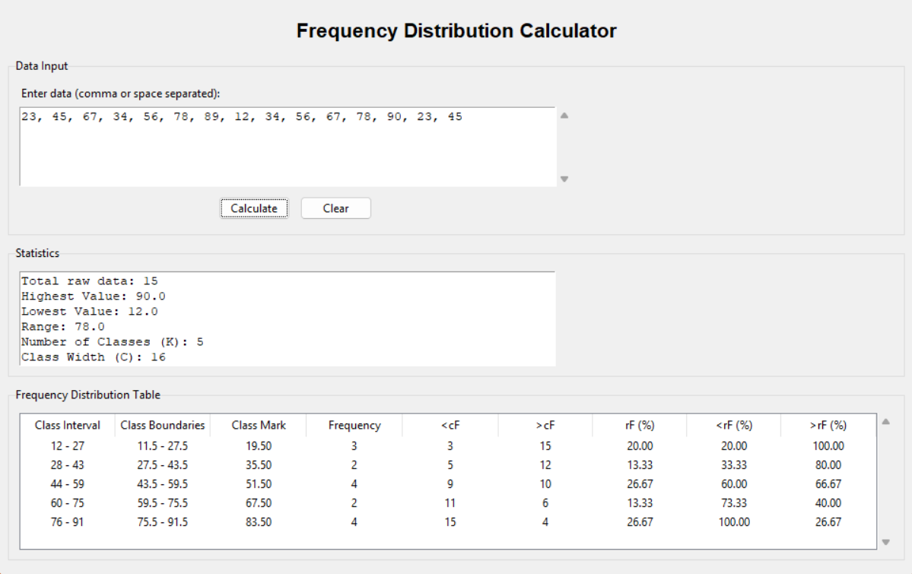
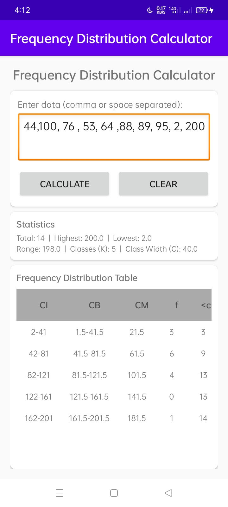

# Frequency Distribution Calculator

*Frequency Distribution Calculator - Python GUI Interface*

A statistical tool that generates frequency distribution tables from raw numerical data.

**C++ Version** - Original console-based implementation from 1st year college  
**Python Version** - Modern GUI version with fullscreen interface

Simple input, automatic calculation of class intervals, frequencies, and cumulative statistics.

